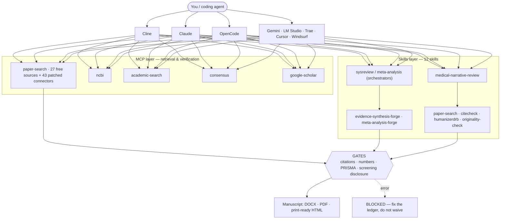
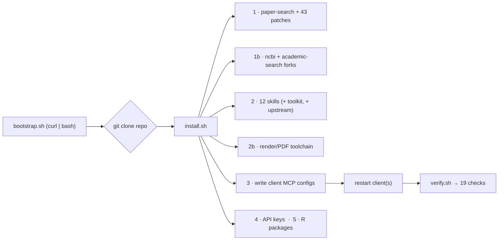
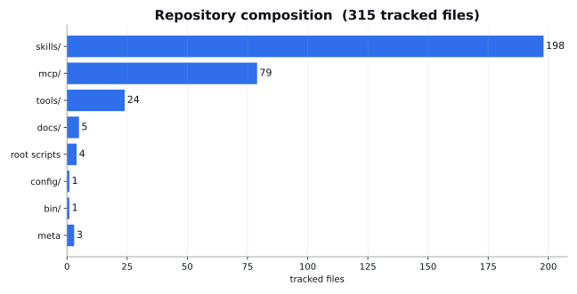
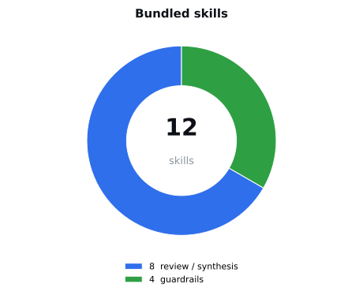
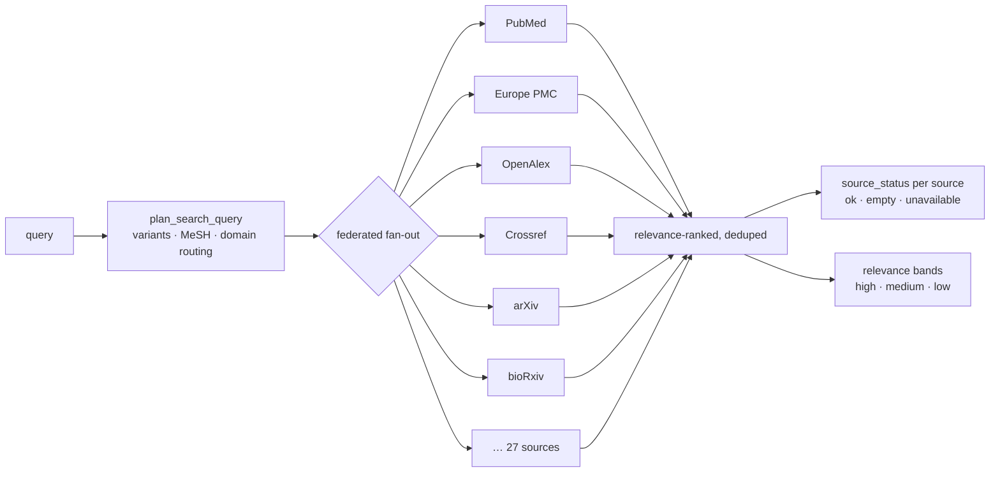
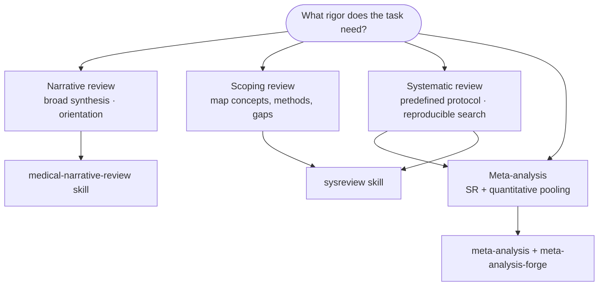
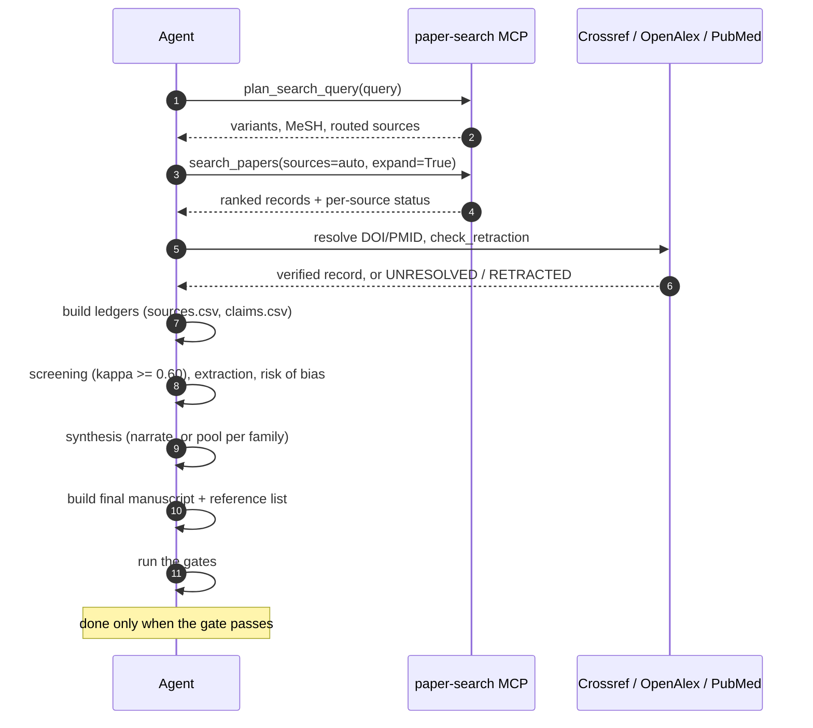
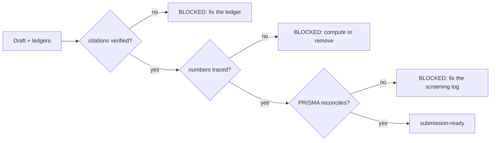
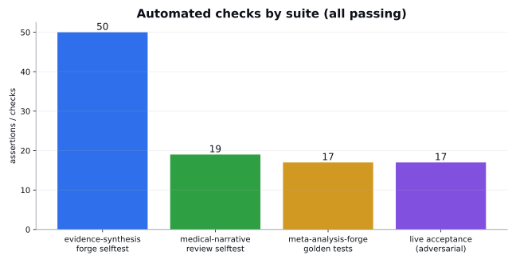
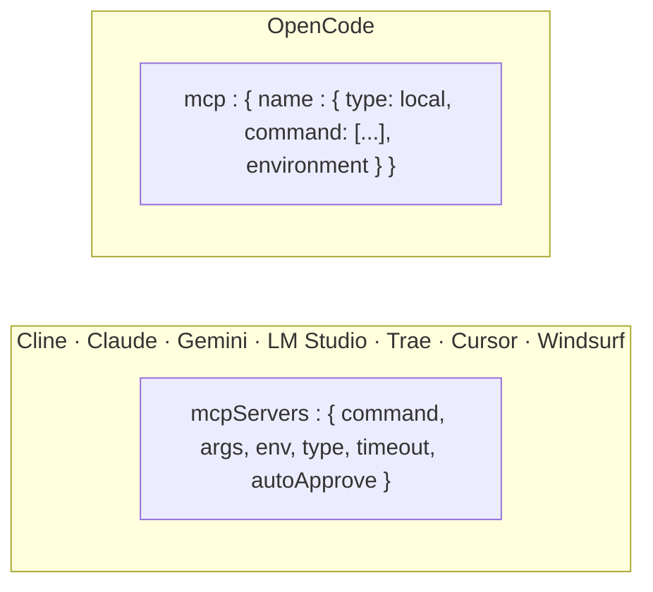

<div align="center">

# research-stack

**Reliable literature-review tooling for AI coding agents.**
The search MCP servers **plus** the systematic / scoping / narrative-review and
meta-analysis skills — installed in one command and wired into Cline, Claude, OpenCode and more.

Built for one promise: **no false citations, no hallucinated numbers, no silent empty searches.**

[](LICENSE)
[](#requirements)
[](#the-mcp-layer)
[](#the-skills-layer)
[](#verification--testing)
[](https://github.com/drb253/research-stack/actions/workflows/ci.yml)
[](#install)

</div>

> **TL;DR** — one command installs **5 MCP servers + 12 gated review skills** for
> Cline, Claude, OpenCode and more, so an agent can run a systematic / scoping /
> narrative review or a meta-analysis that **cannot cite a paper that does not
> exist, quote a number nobody computed, or report screening it never performed.**
> Zero keys needed to start; the three local MCP servers need **no network** (all vendored).

---

## Install (one command)

```bash
curl -fsSL https://raw.githubusercontent.com/drb253/research-stack/main/bootstrap.sh | bash -s -- \
  --targets cline,claude,opencode
```

Clones the repo to `~/.research-stack-src`, installs the MCP servers + skills, and
writes each selected client's config. Restart your client afterwards, then verify:

```bash
~/.research-stack-src/verify.sh --targets cline,claude,opencode
```

Prefer a clone?

```bash
git clone https://github.com/drb253/research-stack.git && cd research-stack
./install.sh --targets cline,claude,opencode --email you@org
```

### 60-second quickstart

```text
1  install        curl … | bash -s -- --targets cline,claude,opencode
2  restart        the client (MCP servers spawn only at startup)
3  verify         ~/.research-stack-src/verify.sh --targets cline,claude,opencode
4  use it         in the client, run:  /sysreview <research question>
```

`verify.sh` finishes with a single verdict — and it fails loudly rather than
guessing:

```text
RESULT: <n> passed, 0 failed
RESEARCH-STACK VERIFIED
```

---

## Contents

- [How it's different](#how-its-different)
- [Why this exists](#why-this-exists)
- [Architecture](#architecture)
- [Install (one command)](#install-one-command)
- [Install options](#install-options)
- [What gets installed](#what-gets-installed)
- [The MCP layer](#the-mcp-layer)
- [The skills layer](#the-skills-layer)
- [The review pipeline](#the-review-pipeline)
- [Correctness guarantees](#correctness-guarantees)
- [Verification & testing](#verification--testing)
- [Platforms](#platforms)
- [API keys & access (100% output)](#api-keys--access-how-to-get-100-output)
- [Worked example](#worked-example)
- [Command reference](#command-reference)
- [Updating](#updating)
- [Repository layout](#repository-layout)
- [Troubleshooting & FAQ](#troubleshooting--faq)
- [Security & privacy](#security--privacy)
- [Contributing](#contributing)
- [Roadmap](#roadmap)
- [Credits](#credits)
- [License & provenance](#license--provenance)

---

## How it's different

| Capability | Plain LLM | Search MCPs alone | **research-stack** |
|---|:---:|:---:|:---:|
| Finds literature | ⚠️ from memory | ✅ live | ✅ live · 27 sources |
| Every citation verified against the DOI | ❌ | ❌ | ✅ |
| Every number traceable to a computed artifact | ❌ | ❌ | ✅ |
| PRISMA flow reconciles with the search + screening logs | ❌ | ❌ | ✅ |
| Refuses retracted / unverified / non-included sources | ❌ | ❌ | ✅ |
| Honest disclosure of AI-run screening | ❌ | ❌ | ✅ |
| Refuses AI- / plagiarism-detector evasion | ❌ | ✅ | ✅ |

The value is not the prose — it is the **enforced chain** from a research
question to a verified, reproducible, submission-ready manuscript.

---

## Why this exists

General-purpose agents happily write a *fluent* review that cites a paper that
does not exist, quotes an effect size nobody measured, and reports a PRISMA flow
figure that contradicts its own screening log. This stack makes those failures
**impossible to pass silently**: every factual claim is chained to a
verified identifier, every number must trace to a computed artifact, and every
stage is a gate that fails loudly instead of filling a gap from memory.

| Principle | Enforced by |
|---|---|
| No citation enters the review until its DOI/PMID resolves and the title matches | `cross_verify_citations.py`, `audit_citations.py`, `validate_sources.py` |
| No number appears that was not computed by the analysis | `numbers_provenance.py`, `check_numbers.py` |
| PRISMA counts must reconcile with the search + screening logs | `prisma_flow.py`, `make_prisma_flow.py`, `check_ledger_completeness.py` |
| Retracted / unverified / non-included sources cannot be cited | retraction checks (Crossref · OpenAlex · PubMed) + ledger gates |
| Machine-run screening is never reported as human screening | `check_screening_disclosure.py` |
| Detector-evasion is refused by design | `humanizerdrb`, `citecheck`, `originality-check` |

---

## Architecture



The stack is deliberately layered: the **MCP layer** fetches and verifies raw
records; the **skills layer** turns them into gated, reproducible artifacts; the
**gates** are the single authority on whether a document is finished.

---

## Install options

```text
--targets LIST   cline,claude,opencode,gemini,lmstudio,trae,cursor,windsurf   (default: cline)
--minimal        skills + paper-search only (skip ncbi, academic-search, render, R)
--no-ncbi / --no-academic-search / --no-render / --no-r   skip one default step
--no-upstream-skills     skip the 160+ K-Dense scientific skills
--copy-skills    copy skills instead of symlinking
--reinstall      reinstall/upgrade the paper-search tool first
--with-runtime   also create the Python toolchain venv (scipy/pandas/...)
--email ADDR     NCBI / polite-pool email        (env NCBI_EMAIL)
--ncbi-key KEY   NCBI API key                    (env NCBI_API_KEY)
--s2-key KEY     Semantic Scholar key            (env S2_API_KEY)
--dry-run        print exactly what would happen, change nothing
-h, --help
```

Every step is **idempotent** and **non-destructive**: existing client configs are
backed up (`.bak.<timestamp>`) and only the managed MCP keys are merged in.



---

## What gets installed

<div align="center">
  
  
</div>

| Layer | Contents |
|---|---|
| **MCP servers** | `paper-search`, `ncbi`, `academic-search` (**all three vendored, pre-patched**) + `consensus` / `google-scholar` (remote) |
| **Review skills** | `sysreview`, `meta-analysis`, `evidence-synthesis-forge`, `meta-analysis-forge`, `medical-narrative-review`, `umbrella-review-skeptic`, `meta-ml-screener`, `environment-life-review-forge` |
| **Guard skills** | `paper-search`, `citecheck`, `humanizerdrb`, `originality-check` |
| **vendored MCP source** | `mcp/paper-search-mcp/` (upstream `v0.1.4` + 43 patched modules), `mcp/ncbi-mcp-server/`, `mcp/academic-search-mcp/` — installed with **no network** |
| **Toolbox & tools** | `originality-toolkit` (23 files), `verification_report.py` |
| **Render/PDF** | `browser-probe` venv — playwright + chromium, pypdf, pypdfium2, reportlab, pillow |
| **R engine** | metafor, meta, netmeta, robumeta, clubSandwich, robvis, esc, mvmeta, ggplot2 |
| **Upstream (optional)** | the 160+ K-Dense scientific skills, cloned (MIT), not vendored |

### Requirements

- **macOS or Linux**, `git`, `curl`, `python3` (3.9+).
- `node`/`npx` 18+ — for the two remote servers (`consensus`, `google-scholar`).
- `uv` — installed automatically if missing.
- `R` — only for the meta-analysis engine; skipped with a warning if absent.

---

## The MCP layer

Five MCP servers give the skills their retrieval and verification surface.

| Server | Kind | What it adds |
|---|---|---|
| **paper-search** | local, `uv` tool | 27 free-first sources, federated search, query planning, retraction check, citation export |
| **ncbi** | local, venv (vendored) | E-utilities: PubMed search, MeSH terms, related articles, batch fetch |
| **academic-search** | local, venv (vendored) | Semantic Scholar / Crossref / OpenAlex multi-provider search |
| **consensus** | remote (`npx mcp-remote`) | semantic search over 400M+ papers |
| **google-scholar** | remote (`npx mcp-remote`) | Google Scholar results, citations, case law |

`paper-search` fans a query out across sources concurrently, bounds each source
with a wall-clock budget, and **never reports a failed source as "no results"**:



> **Vendored, not fetched.** All three local servers ship complete in this repo —
> `mcp/paper-search-mcp/` (upstream `v0.1.4` + the 43 patched modules),
> `mcp/ncbi-mcp-server/`, and `mcp/academic-search-mcp/` — so the installer builds
> them from source with **no network** and never depends on PyPI or a moving
> upstream HEAD.

> **Audit fix included.** The MeSH query-planner previously expanded common words
> to a *subheading's* entry terms (e.g. `screening → diagnosis, signs, findings,
> symptoms`). It now reads NCBI's authoritative mapping (`screening → mass
> screening, early detection of cancer`); `audit_fix_check.py` proves it on every
> install.

---

## The skills layer

Twelve skills, each a folder with a `SKILL.md`. The orchestrators sequence the
others; each stage is gated and ledgered, and no stage is skipped.

| Skill | Role | Key artifacts |
|---|---|---|
| **sysreview** | end-to-end systematic/scoping/umbrella review entry point (`/sysreview`) | `sources.csv`, `claims.csv`, `search_log.csv`, `prisma_counts.json`, `GATE_REPORT.json` |
| **meta-analysis** | quantitative-synthesis entry point (`/meta-analysis`); poolability gate first | coding sheet → pooled estimate + forest/funnel plots |
| **evidence-synthesis-forge** | review orchestrator: protocol, search, screening, coding, reporting | PRISMA-S appendix, SoF tables, integrity gates |
| **meta-analysis-forge** | the statistics: effect sizes, models, heterogeneity, meta-regression | R engine (`cochrane_meta.R`), `golden_tests.R` |
| **medical-narrative-review** | publication-ready narrative review with a hard submission gate | verified reference list, evidence tables, DOCX/PDF/HTML |
| **umbrella-review-skeptic** | synthesis of existing reviews / second-order meta-analysis | overlap matrix, quality scorecard |
| **meta-ml-screener** | ML/LLM-assisted screening & extraction with audit logs | screening log (human decisions retained) |
| **environment-life-review-forge** | PECO/PICO domain adaptation (eco, environmental, life science) | domain schemas + audit templates |
| **paper-search** | how to drive the retrieval MCPs correctly | query routing, retraction, export |
| **citecheck** | audit & build citations; flag retractions | reference list in 7 styles; A1–A10 audit |
| **humanizerdrb** | de-slop prose without changing meaning | "What changed" list; refuses detector evasion |
| **originality-check** | attribution check for your own drafts | verified BibTeX + paraphrase worksheet |

### Choosing a review type



---

## The review pipeline



Each arrow is a **file on disk**. If a link is missing, the review is not
finished, and the gate says so explicitly rather than filling the gap.

---

## Worked example

> *Illustrative — the shape of a run, not a real dataset. Every number a real run
> prints is computed and traceable; none is invented.*

```
You:  /sysreview Do SGLT2 inhibitors reduce heart-failure hospitalisation?

  Stage 0  question + protocol ........ PICO locked, scope + PROSPERO draft
  Stage 1  registered search .......... plan_search_query → variants + MeSH + routing
  Stage 2  deduplicate ................ DOI → PMID → title
  Stage 3  screen (κ ≥ 0.60 gate) ..... title → abstract → full text
  Stage 4  extract .................... one row per effect, with a locator
  Stage 5  risk of bias ............... RoB 2 for RCTs, ROBINS-I otherwise
  Stage 6  synthesise ................. narrate (SWiM) or pool per effect family
  Stage 7  citation gate .............. every cited DOI resolves + title matches
  Stage 8  number gate ................ every value traced to results.json
  Stage 9  PRISMA figure .............. reconciles with search + screening logs
  Stage 10 manuscript ................. DOCX · PDF · print-ready HTML

  GATE  PASS   → submission-ready        (AI-assisted; CONDUCT_DISCLOSURE attached)
  GATE  FAIL   → BLOCKED                 (fix the ledger — never waive silently)
```

The point is the last two lines: a review is finished **only** when the gate
passes, and the gate is a set of scripts that can each fail.

---

## Command reference

**`install.sh`** (also driven by `bootstrap.sh`):

| Flag | Effect |
|---|---|
| `--targets LIST` | `cline,claude,opencode,gemini,lmstudio,trae,cursor,windsurf` (default `cline`) |
| `--minimal` | skills + paper-search only |
| `--no-ncbi` · `--no-academic-search` · `--no-render` · `--no-r` | skip one default step |
| `--no-upstream-skills` | skip the 160+ K-Dense scientific skills |
| `--from-pypi` | install paper-search from PyPI + apply patches (legacy) |
| `--reinstall` | rebuild the vendored paper-search tool |
| `--copy-skills` | copy skills instead of symlinking |
| `--with-runtime` | also build the Python toolchain venv |
| `--email` · `--ncbi-key` · `--s2-key` | write API settings |
| `--dry-run` | print actions, change nothing |

**`verify.sh`** — `--targets LIST`, plus `--help`. **`publish.sh`** —
`--user <gh> [--repo] [--branch] [--no-push]`.

---

## Correctness guarantees

The gates are the authority. A gate that cannot fail is not a gate — so every one
is tested on **both** its pass and its fail path.



| Gate | Fails when | Script |
|---|---|---|
| Citation verification | a cited DOI is unresolved / retracted / resolves to a different paper | `cross_verify_citations.py` |
| Ledger verification | an included source is unverified, has no identifier, or a duplicate | `validate_sources.py` |
| Claim ↔ source join | a claim cites an unknown / unverified / excluded / retracted source | `audit_citations.py` |
| Number provenance | a number in the write-up is not traceable to a computed artifact | `numbers_provenance.py`, `check_numbers.py` |
| PRISMA reconciliation | the flow figure does not balance against search + screening | `prisma_flow.py`, `make_prisma_flow.py` |
| Ledger completeness | `removed_other` / `not_retrieved` are non-zero without a value-matched waiver | `check_completeness.py` |
| Screening disclosure | machine screening described as human, or no conduct disclosure | `check_screening_disclosure.py` |
| Appraisal honesty | a risk-of-bias tool is named but the appraisal is a placeholder | `check_appraisal.py` |
| Review integrity | template/placeholder leakage into a rendered deliverable | `check_review_integrity.py` |
| Gate coverage | any gate is exercised on only one path | `check_selftest_coverage.py` |
| Acceptance (live) | any adversarial case (retracted DOI, unregistered DOI, false human-screening claim, stale waiver, mixed estimands) does **not** fail | `acceptance_test.py` |

---

## Verification & testing

<div align="center"></div>

**103 automated checks, all passing.** Run them after any change:

```bash
S=~/.research-stack/skills
bash  $S/evidence-synthesis-forge/scripts/doctor.sh              # toolchain report
bash  $S/evidence-synthesis-forge/scripts/selftest.sh            # 50 — every gate, pass+fail
Rscript $S/meta-analysis-forge/scripts/golden_tests.R           # 17 — engine vs metafor
bash  $S/medical-narrative-review/scripts/selftest.sh           # 19 — narrative-review chain
python3 $S/evidence-synthesis-forge/scripts/acceptance_test.py  # 17 — live adversarial
./verify.sh --targets cline,claude,opencode                      # install acceptance
```

The engine is checked against `metafor`'s canonical datasets (`dat.bcg`,
`dat.normand1999`) plus closed-form maths, so a pooled estimate, τ², I² and Q are
never merely "plausible" — they are reproduced. The live acceptance run
deliberately tries to break each guard (a **real** retracted DOI, an unregistered
DOI, a false human-screening claim, an unwaived completeness gap, a stale
waiver, mixed estimands): every adversarial case **must fail**, and the run
passes only when each one does.

---

## Platforms

`install.sh` writes each client's native MCP schema (backing up what's there).

| Client | Skills dir | MCP config |
|---|---|---|
| **Cline** | `~/.cline/skills` | `~/.cline/data/settings/cline_mcp_settings.json` |
| **Claude Desktop** | `~/.claude/skills` | `…/Claude/claude_desktop_config.json` (mac) · `~/.config/Claude/…` (linux) |
| **OpenCode** | `~/.config/opencode/skills` | `~/.config/opencode/opencode.json` (`mcp` · `type: local`) |
| **Gemini CLI** | `~/.gemini/skills` | `~/.gemini/settings.json` |
| **LM Studio** | `~/.lmstudio/skills` | `~/.lmstudio/mcp.json` |
| **Trae** | — | `…/Trae/User/mcp.json` |
| **Cursor** | — | `~/.cursor/mcp.json` |
| **Windsurf** | — | `~/.codeium/windsurf/mcp_config.json` |
| **Codex** | `~/.codex/skills` | *(TOML — configure manually)* |

Two shapes are emitted:



Generated configs carry the real `autoApprove` tool lists and `timeout` values
from the working setup, so the search tools do not need per-call approval.

---

## API keys & access (how to get 100% output)

The stack is **free-first**: with **zero keys** you already get the full 27-source
search, DOI/PMID resolution, retraction checks, and every skill and gate. Keys do
not unlock *correctness* — they unlock **coverage, rate limits, and PDF access**.
To reach **100% of the repo's retrieval output**, add the settings below.

All paper-search settings live in one auto-loaded file:

```ini
# ~/.config/paper-search-mcp/.env   (chmod 600)
# Preferred names carry the PAPER_SEARCH_MCP_ prefix; the bare names also work.
```

### Tier 0 — no keys (works out of the box)

Free sources, Crossref / OpenAlex / DataCite resolution, retraction checks, the
12 skills and all gates. **≈90% of output.**

### Tier 1 — recommended, free (~2 minutes) → unlocks the rest of the free tier

| Setting | Env var(s) | Where to get it | Unlocks |
|---|---|---|---|
| **Contact email** ⭐ | `PAPER_SEARCH_MCP_OPENALEX_EMAIL`, `PAPER_SEARCH_MCP_UNPAYWALL_EMAIL`, `PAPER_SEARCH_MCP_NCBI_EMAIL` (+ bare `NCBI_EMAIL`) | your own email (no account) | OpenAlex **polite pool** (avoids HTTP 429), **open-access PDF resolution** (Unpaywall *requires* an email), NCBI polite pool |
| **NCBI API key** ⭐ | `PAPER_SEARCH_MCP_NCBI_API_KEY` + `NCBI_API_KEY` | https://www.ncbi.nlm.nih.gov/account/settings/ | E-utilities **3 → 10 req/s** (PubMed, PMC, MeSH, `convert_paper_ids`) |
| **Semantic Scholar key** ⭐ | `PAPER_SEARCH_MCP_SEMANTIC_SCHOLAR_API_KEY` + `SEMANTIC_SCHOLAR_API_KEY` | https://www.semanticscholar.org/product/api | Semantic Scholar at policy rate (1 req/s) |
| OpenAlex key | `PAPER_SEARCH_MCP_OPENALEX_API_KEY` | https://openalex.org/settings/api | higher OpenAlex limits |
| DOAJ key | `PAPER_SEARCH_MCP_DOAJ_API_KEY` | https://doaj.org/apply-for-api-key/ | public 100 req/hr → higher |
| CORE key | `PAPER_SEARCH_MCP_CORE_API_KEY` | https://core.ac.uk/services/api | CORE quota |
| Zenodo token | `PAPER_SEARCH_MCP_ZENODO_ACCESS_TOKEN` | https://zenodo.org/account/settings/applications/ | Zenodo quota |
| OpenAIRE key | `PAPER_SEARCH_MCP_OPENAIRE_API_KEY` | https://develop.openaire.eu/ | OpenAIRE quota |

> ⚠️ **Naming gotcha:** paper-search's Semantic Scholar connector reads
> **`SEMANTIC_SCHOLAR_API_KEY`**, *not* `S2_API_KEY` (the separate `academic-search`
> MCP reads `S2_API_KEY`). `install.sh` writes **both** names for you.

### Tier 2 — keyed publisher sources (free keys, **quota-limited**) → the last ~10%

| Setting | Env var(s) | Where to get it | Unlocks | Quota |
|---|---|---|---|---|
| **Springer Nature** (two keys) | `PAPER_SEARCH_MCP_SPRINGER_NATURE_META_API_KEY` + `…_OPENACCESS_API_KEY` | https://dev.springernature.com | 2 extra sources incl. **Springer OA full text (JATS)** | 500/day **per key** |
| **Elsevier / Scopus** | `PAPER_SEARCH_MCP_ELSEVIER_API_KEY` (+ `…_ELSEVIER_INSTTOKEN`) | https://dev.elsevier.com | Scopus metadata search | full text needs the institutional token |
| IEEE / ACM (paid corpora) | `PAPER_SEARCH_MCP_IEEE_API_KEY` / `…_ACM_API_KEY` | IEEE / ACM developer portals | paid-index coverage | paid |
| Google Scholar proxy | `PAPER_SEARCH_MCP_GOOGLE_SCHOLAR_PROXY_URL` | a scraping proxy | optional — use the `google-scholar` MCP instead | — |

> ⚠️ **Quota note:** Springer and Elsevier keys make `sources="all"` spend their
> daily quota on every sweep. Prefer `sources="auto"`.

### Other MCP servers — what they need

| Server | Key needed | Where / how |
|---|---|---|
| `consensus` | none | `npx mcp-remote` OAuth — a browser opens on first use |
| `google-scholar` | none (HasData) | `npx mcp-remote` — first-run auth via HasData |
| `ncbi` | `NCBI_EMAIL` + `NCBI_API_KEY` | written into its MCP `env` by `install.sh` |
| `academic-search` | `S2_API_KEY` | written into its MCP `env` by `install.sh` |

### Reach 100% in one command

```bash
./install.sh --targets cline,claude,opencode \
  --email you@example.org \
  --s2-key  <semantic-scholar-key> \
  --ncbi-key <ncbi-key>
# then paste the Springer + Elsevier keys into ~/.config/paper-search-mcp/.env
# and restart the client.  Re-running install.sh is safe (it appends).
```

Copy the full annotated template from
[`config/paper-search.env.template`](config/paper-search.env.template) if you
prefer to edit it by hand. Nothing here is required for the gates to pass — keys
only widen what the search layer can *find*.


---

## Updating

`paper-search-mcp` is **vendored** (upstream `v0.1.4` + our patches) and installed
from the repo, so `uv tool upgrade` no longer touches it. Update from source:

```bash
git -C ~/.research-stack-src pull
~/.research-stack-src/install.sh --reinstall     # rebuild the uv tool from the vendored source
```

The skills are symlinked from `~/.research-stack/skills`, so a pull is enough:

```bash
git -C ~/.research-stack-src pull && ~/.research-stack-src/install.sh --no-mcp
```

Prefer the classic PyPI base + runtime patches? Use `install.sh --from-pypi`.

---

## Repository layout

```text
research-stack/
├── install.sh · bootstrap.sh · verify.sh · publish.sh
├── CHANGELOG.md · LICENSE · README.md
├── .github/workflows/ci.yml        # CI: lint (ubuntu+macos) + R engine/gate tests
├── bin/mcp_config.py               # per-client MCP config writer (8 schemas)
├── scripts/make_readme_charts.py   # regenerates assets/*.svg
├── assets/                         # coverage · composition · skills (SVG)
├── config/paper-search.env.template
├── docs/  PLATFORMS.md · original/ (SETUP.md · AGENT_PROMPT.md · VERIFY.md)
├── skills/                         # 12 review/guard skills  (198 files)
├── tools/  originality-toolkit/ (23 files) · verification_report.py
└── mcp/
    ├── paper-search-mcp/            # vendored, pre-patched (upstream v0.1.4 + 43 patches)
    ├── ncbi-mcp-server/             # vendored ncbi fork (patched)  + tests
    ├── academic-search-mcp/         # vendored academic-search fork
    ├── paper-search-patches/        # 43 connectors + apply_patches.py + audit_fix_check.py
    └── optional/browser-probe.requirements.txt   # render/PDF toolchain pins
```

---

## Troubleshooting & FAQ

| Symptom | Fix |
|---|---|
| A server does not appear after install | Clients spawn MCP servers **only at startup** — fully quit and reopen. |
| `consensus` / `google-scholar` fail | Install Node.js 18+ (`npx` is required). |
| paper-search returns nothing / arXiv empty | Rebuild the vendored tool: `~/.research-stack-src/install.sh --reinstall`. |
| A config was clobbered | Restore the `.bak.<timestamp>` written next to it. |
| `ncbi` / `academic-search` won't start | Their vendored fork isn't installed — re-run `install.sh` **without** `--no-ncbi` / `--no-academic-search`. |
| `pydantic_core … system policy` (macOS) | Don't install under `/tmp` — Gatekeeper blocks unsigned `.so` there; use your home dir. |
| Meta-analysis errors about R packages | Install R, then re-run `install.sh` (it runs `install_r_packages.R`). |
| `doctor.sh` warns about optional skills | Expected: the 160+ upstream skills are cloned with `--with-upstream-skills`. |

### FAQ

**Is this a replacement for a human reviewer?**
No — it *enforces* verification. Its `CONDUCT_DISCLOSURE` records when screening
and extraction were agent-run, and it will not claim a Cochrane/MECIR-compliant or
human-conducted review.

**Which MCP servers work offline?**
The three **vendored** ones (`paper-search`, `ncbi`, `academic-search`). Only
`consensus` / `google-scholar` (remote) and live DOI checks need the network.

**Do I need API keys?**
No. Keys only widen coverage and raise rate limits — see
[API keys & access](#api-keys--access-how-to-get-100-output).

**Can it defeat Turnitin / AI detectors?**
No, by design. `humanizerdrb`, `citecheck`, and `originality-check` refuse
detector-evasion; they improve writing and fix attribution instead.

---

## Security & privacy

- **No secrets in the repo.** API keys live only in `~/.config/paper-search-mcp/.env`
  (chmod `600`) and client configs (chmod `600`). The vendored forks deliberately
  exclude their `.env*` files.
- **Non-destructive installer.** Existing client configs are backed up
  (`.bak.<timestamp>`); only managed keys are merged.
- **Local-first.** The skills are stdlib-only Python; the three local MCP servers
  run on your machine — nothing is uploaded to a third party.
- **PHI-aware.** The narrative-review ledger linter flags PHI-like patterns
  (email, MRN, DOB, phone) and keeps ledgers metadata-only.
- **No dynamic code.** The local CLIs make no network calls, load no pickle, and
  eval no code.

---

## Contributing

PRs are welcome. Ground rules:

1. **Every gate needs a pass *and* a fail test** — `check_selftest_coverage.py`
   enforces it ("a gate that cannot fail is not a gate").
2. Run the suites before pushing: `doctor.sh`, `selftest.sh` (50),
   `golden_tests.R` (17), `medical-narrative-review/scripts/selftest.sh` (19),
   `acceptance_test.py` (17).
3. **Never** weaken a gate to make a failing fixture pass.
4. Keep the vendored MCP copies in sync via the recipe in each `UPSTREAM.md`.

---

## Roadmap

- [ ] GitHub Actions CI running the 103 checks on every push
- [ ] Codex (TOML) MCP config support
- [ ] A terminal demo / screen recording in the README
- [ ] Auto re-vendor script (fetch a new upstream tag, re-apply patches)
- [ ] Windows (WSL) setup notes

---

## Credits

Built on the shoulders of open source:

- **[paper-search-mcp](https://github.com/openags/paper-search-mcp)** (MIT) — vendored at `v0.1.4` + 43 patched modules.
- **[ncbi-mcp-server](https://github.com/vitorpavinato/ncbi-mcp-server)** (MIT) — vendored fork.
- **academic-search** — vendored fork `0.8.0+local1`.
- **[K-Dense scientific-agent-skills](https://github.com/K-Dense-AI/scientific-agent-skills)** (MIT) — the 160+ upstream skills.
- The bundled review skills (EvidenceForge, MIT) merge methodology from several
  open projects, credited per-skill in each `NOTICE.md`.

---

## License & provenance

MIT — see [LICENSE](LICENSE). The bundled review skills are MIT (EvidenceForge)
with merged methodology credited in each skill's `NOTICE.md`; the upstream
scientific-skills pack (K-Dense Inc., MIT) is **cloned, not vendored**. Nothing
here defeats AI- or plagiarism-detectors; the guard skills explicitly refuse that.

<div align="center"><sub>
Built so that a fluent paragraph is never mistaken for a verified one.
</sub></div>


